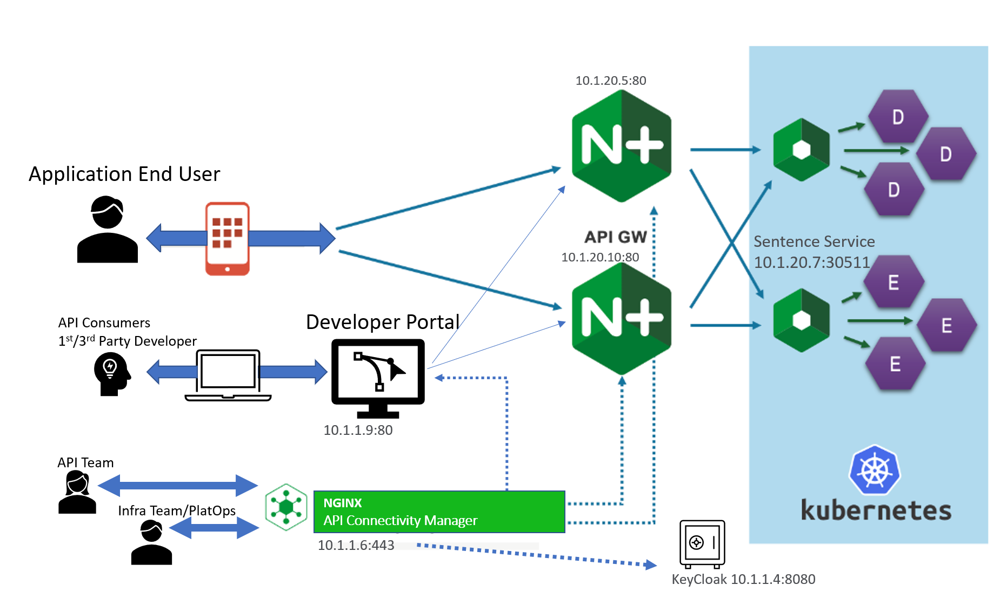

NGINX NMS - ACM - Python Script
----------------------------------------------  

Note: this is not (yet) a Python module. It is for today, just a script.

The main file is nms_acm_udf_lab.py

This script does in an automated fashion, the configuration of modules 1 through 6 of Matthieu Dierick's UDF Lab "Nginx NMS API Connectivity Manager (ACM)"
This is the manual lab guide: https://clouddocs.f5.com/training/community/nginx/html/class10/class10.html  

Instructions:   
-------------------------

0. Deploy the UDF "Nginx NMS API Connectivity Manager (ACM)" then clone this repo to one of the ubuntu boxes in the UDF, and then run this script there.
  
1. Set your environment variables:  
( you can source set_environment.sh if you like )
  
Most of these are self explanatory.  

export NGINX_NMS_HOSTNAME='10.1.1.6'    
export NGINX_NMS_USERNAME='admin'    
export NGINX_NMS_PASSWORD='admin'    
export NGINX_APIGW_HOSTNAME='10.1.1.5'    
export NGINX_APIGW_USERNAME='ubuntu'    
export NGINX_APIGW_PASSWORD='ubuntu'    
export NGINX_APIGW_SSH_KEYFILE='/home/ubuntu/.ssh/brett-udf'    
export NGINX_DEVPORTAL_HOSTNAME='10.1.1.9'    
export NGINX_DEVPORTAL_USERNAME='ubuntu'    
export NGINX_DEVPORTAL_PASSWORD='ubuntu'    
export NGINX_DEVPORTAL_SSH_KEYFILE='/home/ubuntu/.ssh/brett-udf'    

2. Get your Linux box ready for Python!

sudo apt update    
sudo apt install python3-pip    
pip install -r requirements.txt    

3. Set up your SSH keys on the devportal and apigw host, and on the host you are running this script from.
  
Then you can try out the example Python script:

python3 nms_acm_udf_lab.py    

or with debugging goodness, add --debug true

Diagram
-------

  
  
  
Example Output
--------------
  
<pre>
Workspace:  
  sentence  
    environments:  
      test  
         API Gateways:  
           brett2.seattleis.cool:80 HTTPclusterName:cluster1  
Workspace:  
  anotherworkspace  
    environments:  
      env1  
         API Gateways:  
           devclus1:80 HTTPclusterName:devclus1  
           devclus1:80 HTTPclusterName:devclus2  
           hostname12:80 HTTPclusterName:cluster12  
           hostname12:80 HTTPclusterName:cluster13  
           acm.devclus1:81 HTTPclusterName:devclus2  
           acm.devclus1:81 HTTPclusterName:devclus1  
      env2  
         API Gateways:  
           hostname22:80 HTTPclusterName:env2  
</pre>
